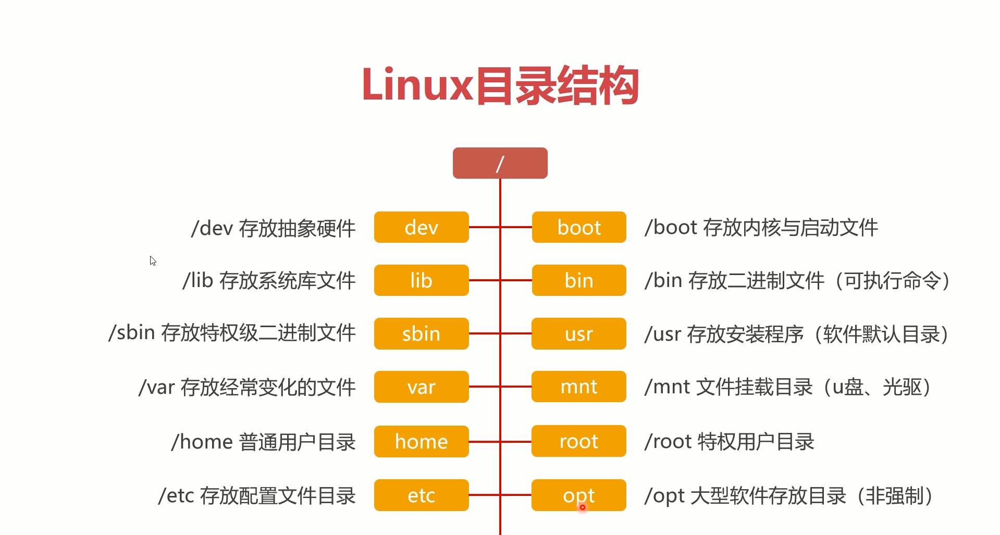

# Linux常用命令

*2019/11/20*

> Linux常用命令

## Linux 目录结构

## Linux目录与文件管理

## 刷新本地包索引

    `sudo apt update`
## Git安装

  `sudo apt-get install git`
  
  `yum install -y git`

## Node安装

- 从存储库安装Node.js：

`sudo apt install nodejs`

- 需要额外安装npm。你可以通过输入以下命令来完成
  
`sudo apt install npm`

## docker 安装

- 复制一个.env

`cp -n .env.example .env`

`docker-compose build`

`docker-compose run --rm web config generate-secret-key`

`docker volume create --name=sentry-data && docker volume create --name=sentry-postgres`

## docker升级

https://www.cnblogs.com/wdliu/p/10194332.html
